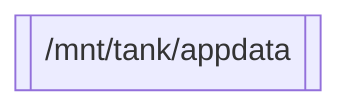
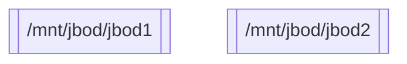
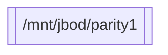
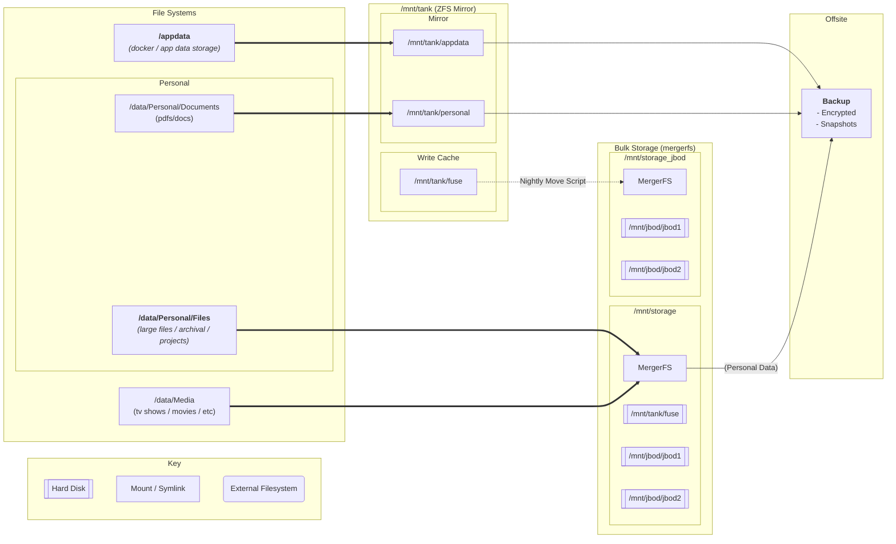

# NAS / Home Application Server

# Storage

## Overview

Data on sinix is classified into three kinds:
1. Essential
2. App Data
3. Reproducable

### Essential Data

This is my personal data and files that I require 100% guarantee it won't be lost. This must follow the 3-2-1 strategy:
- 3 Copies
- 2 Mediums
- 1 Offsite

Within this tier there are two kinds of files:
- Small (<~100MB, documents etc)
- Large (>~100MB, files, documents)

The former exists on a ZFS mirror (fulfilling two of the three copies).
The latter are too big to go on the ZFS mirror and instead exist on the snapraid array. (Parity data is not quite another copy, but is good enough for my needs, as the data is also backed up offsite).

All data in this tier is backed up off-site via a nightly process.

### App Data

This is the configuration and storage for various self-hosted applications. Some of these applications are hosting personal/essential data, so this whole tier also follows the 3-2-1 strategy.

- Stored on ZFS mirror
- Backed up offsite nightly 
- Less frequent snapshot strategy than Personal data as higher churn.

### Reproducable

Large files that I can re-acquire if needed in the event of a disk / array failure. These files are on the snapraid array so have some redundancy, but are not backed up offsite.

This tier covers backups from other places (so themselves do not need to be backed up again). e.g. macOS Time Machine.

## ZFS Mirror

Simple raid1-style storage array to store hot (e.g. appdata) and smaller personal files. Snapshots are used for local roll-back. Different volumes are used to allow for differing snapshot schedules + performance tweaks.

### `/mnt/tank/appdata`

Working directories for mostly docker apps, databases and such.
##### Snapshot configuration:
- Nightly for last 7 days 
- Weekly for 4 weeks
- Monthly for 2 months

### `/mnt/tank/personal`

Personal files and documents that are small or need fast read/write access. Some docker applications (e.g. paperless) might store their data here.

##### Snapshot configuration:
- 7 * 24hr (nightly for last 7 days)
- 3 * 1wk (weekly snapshots aged 1 week -> 1 month)
- 5 * 1m (monthly snapshots for last five months)
- 1 * 6m (6 months ago)

### `/mnt/tank/fuse`

Acts as a write-cache for the snapraid array. Mergerfs is configured to prefer writing files to this drive. A nightly mover scripts moves files that haven't been accessed in 24 hours to `/mnt/jbod_storage`.

atime tracking is enabled so the script can detect which files can be moved to colder storage.

No snapshots are taken for this volume.

## Snapraid Array

### `/mnt/jbod/jbod[1-9]`

Spinning disks used for mass storage of files/media.

### `/mnt/jbod/parity1`

Large disk used for storing parity information from `/mnt/jbod/jbod[0-9]`.

## MergerFS

### `/mnt/storage`

Combines `/mnt/tank/fuse` and the JBOD drives (`/mnt/jbod/jbod[0-9]`) into a single file-system.

MergerFS is configured to prefer writing to `/mnt/tank/fuse` when there is available space, effectively having the fast NVME-backed ZFS-mirror act as a write-cache in front of the slower spinning-disk array.

A mover script runs nightly to relocate files from `/mnt/tank/fuse` to `/mnt/jbod_storage` when they are no longer in use.

### `/mnt/jbod_storage`

Combines the JBOD drives (`/mnt/jbod/jbod[0-9]`) into a single file-system.

Exists for the purposes of the mover script (see above).

## Topology

Now to actually go and implement this...